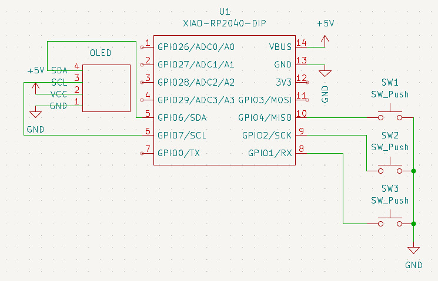
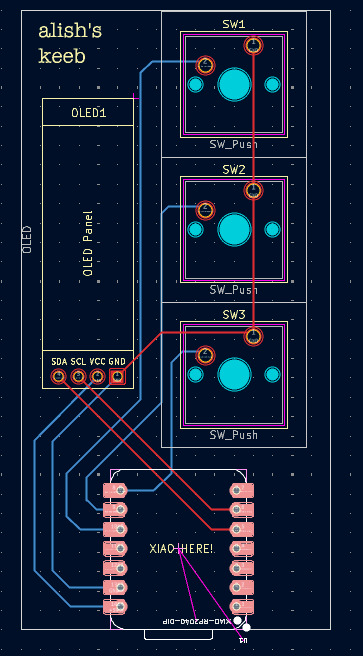
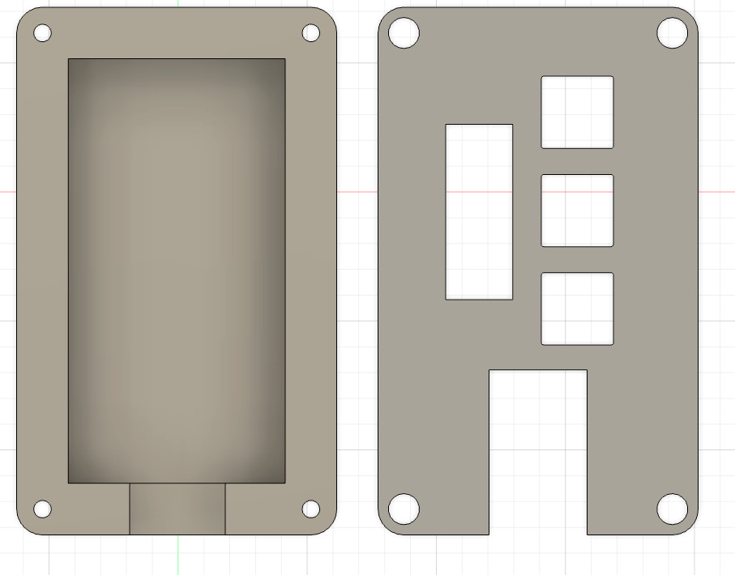

# 3key_oled
A small 3-key macropad with an OLED for my brother.
Each key corresponds to a phrase: "GG", "Ye", "Noice"

---
# Final Product

---

# Design Files

| Schematic | PCB Layout | Case Design |
|----------|------------|-------------|
|  |  |  |

---
# BOM

This is everything I need:

    3x Cherry MX Switches
    3x DSA Keycaps
    4x M3x5x4 Heatset inserts
    4x M3x16mm Screws
    1x 0.91" 128x32 OLED Display
    1x XIAO RP2040
    1x Case (2 printed parts)
    1x PCB
---
# Remarks

It was a fun experience making this hackpad, the 3D design was imo the most difficult, especially trying to get things to line up. 
The OLED pins might be poking into the case, but i'll trim them IRL. 
I'm planning on having the OLED have a cat animation :3

